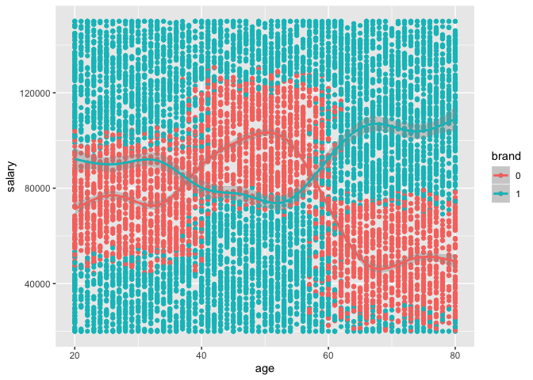
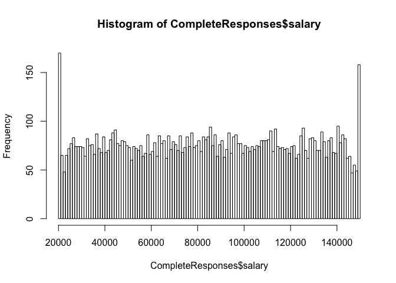
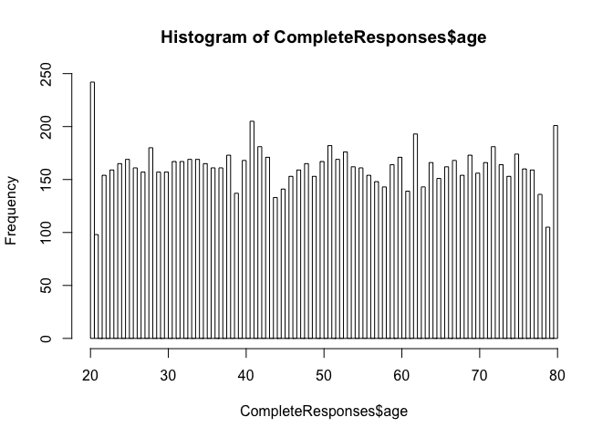
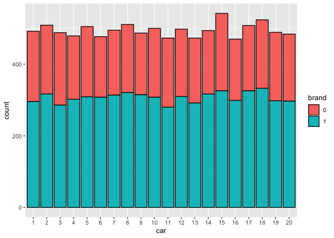
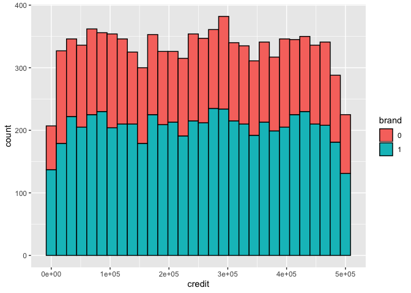

Brand Preference
================
Gherardo Lattanzi

#### Costumer Brand Preference

Hi Danielle, the following is the investigation on wether our customers
prefers Acer or Sony.

``` r
CompleteResponses <- read.csv("../Desktop/UBIQUM/CompleteResponses.csv")
SurveyIncomplete <- read.csv("~/Desktop/UBIQUM/SurveyIncomplete.csv")
```

``` r
library(caret)
```

    ## Loading required package: lattice

    ## Loading required package: ggplot2

``` r
library(ggplot2)
```

# Data Cleaning Operations

``` r
CompleteResponses$elevel <- as.integer(CompleteResponses$elevel)
CompleteResponses$car <- as.factor(CompleteResponses$car)
CompleteResponses$brand <- as.factor(CompleteResponses$brand)
CompleteResponses$zipcode <- as.factor(CompleteResponses$zipcode)
CompleteResponses$age <- as.numeric(CompleteResponses$age)


SurveyIncomplete$elevel <- as.integer(SurveyIncomplete$elevel)
SurveyIncomplete$car <- as.factor(SurveyIncomplete$car)
SurveyIncomplete$brand <- as.factor(SurveyIncomplete$brand)
SurveyIncomplete$zipcode <- as.factor(SurveyIncomplete$zipcode)
SurveyIncomplete$age <- as.numeric(SurveyIncomplete$age)
```

# Brand Preference for Salary and Age

``` r
library(ggplot2)
ggplot(CompleteResponses, aes(x=age, y=salary, col=brand)) +
  geom_point() +
  geom_smooth()
```

    ## `geom_smooth()` using method = 'gam' and formula 'y ~ s(x, bs = "cs")'

<!-- -->

<!-- -->

Question 1: What is your yearly salary, not including bonuses?

``` r
hist(CompleteResponses$salary, breaks = 100)
```

<!-- -->

Question 2: What is your age?

``` r
hist(CompleteResponses$age, breaks = 100)
```

<!-- -->

Question 4: What is your car?

Where: 1 = BMW, 2 = Buick, 3 = Cadillac, 4 = Chevrolet, 5 = Chrysler, 6
= Dodge, 7 = Ford, 8 = Honda, 9 = Hyundai, 10 = Jeep, 11 = Kia, 12 =
Lincoln, 13 = Mazda, 14 = Mercedes Benz, 15 = Mitsubishi, 16 = Nissan,
17 = Ram, 18 = Subaru, 19 = Toyota, 20 = None of the
above

``` r
ggplot(CompleteResponses, aes(x = car, fill = brand)) + geom_bar(colour = "black")
```

<!-- -->

``` r
ggplot(CompleteResponses, aes(x = credit, fill = brand)) + geom_histogram(colour = "black")
```

    ## `stat_bin()` using `bins = 30`. Pick better value with `binwidth`.

<!-- -->

# Define an 75%/25% train/test split

``` r
inTraining <- createDataPartition(CompleteResponses$brand, p = .75, list = FALSE)
training <- CompleteResponses[inTraining,]
testing <- CompleteResponses[-inTraining,]
```

# 10 fold cross validation

``` r
fitControl <- trainControl(method = "repeatedcv", number = 10, repeats = 2)
```

# Random Forest Modelling

``` r
PRED1 <- predict(M0D, testing)
summary(PRED1)
```

    ##    0    1 
    ##  934 1540

``` r
#SurveyIncomplete$brand <- PRED1
```

# Confusion Matrix

``` r
confusionMatrix(PRED1, testing$brand)
```

    ## Confusion Matrix and Statistics
    ## 
    ##           Reference
    ## Prediction    0    1
    ##          0  912   22
    ##          1   24 1516
    ##                                           
    ##                Accuracy : 0.9814          
    ##                  95% CI : (0.9753, 0.9864)
    ##     No Information Rate : 0.6217          
    ##     P-Value [Acc > NIR] : <2e-16          
    ##                                           
    ##                   Kappa : 0.9605          
    ##                                           
    ##  Mcnemar's Test P-Value : 0.8828          
    ##                                           
    ##             Sensitivity : 0.9744          
    ##             Specificity : 0.9857          
    ##          Pos Pred Value : 0.9764          
    ##          Neg Pred Value : 0.9844          
    ##              Prevalence : 0.3783          
    ##          Detection Rate : 0.3686          
    ##    Detection Prevalence : 0.3775          
    ##       Balanced Accuracy : 0.9800          
    ##                                           
    ##        'Positive' Class : 0               
    ## 

# 

with other method
\#\#\#\#\#\#\#\#\#\#\#\#\#\#\#\#\#\#\#\#\#\#\#\#\#\#\#\#\#\#\#\#\#\#\#\#\#\#\#\#\#\#\#\#\#\#\#\#\#\#\#\#\#\#\#\#\#\#\#\#\#\#\#\#\#\#\#\#\#\#\#\#\#\#\#\#\#\#\#\#\#\#\#\#\#\#\#

#### C5.0 Modelling

# Apply Model to SurveyIncomplete

``` r
PRED2 <- predict(MODC5, SurveyIncomplete)
```

# this is to compare the testing brand preference prediction and the actual value.

``` r
postResample <- postResample(PRED2, testing$brand) 
```

``` r
varImp(MODC5)
```

    ## C5.0 variable importance
    ## 
    ##   only 20 most important variables shown (out of 31)
    ## 
    ##          Overall
    ## salary    100.00
    ## age        85.17
    ## car4       16.55
    ## car13       8.01
    ## car10       0.00
    ## zipcode6    0.00
    ## car17       0.00
    ## car2        0.00
    ## car12       0.00
    ## car7        0.00
    ## zipcode5    0.00
    ## zipcode1    0.00
    ## zipcode7    0.00
    ## car5        0.00
    ## credit      0.00
    ## car20       0.00
    ## car11       0.00
    ## elevel      0.00
    ## car3        0.00
    ## zipcode2    0.00

``` r
TotData <-rbind(SurveyIncomplete, CompleteResponses)
```

# Total Number of Acer and Sony Preferences Sampled

``` r
#summary(TotData$brand)
#  0(Acer)    1(Sony)
#  8744         6154 
```
